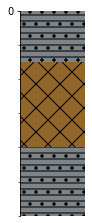
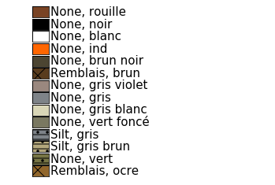
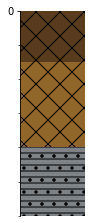
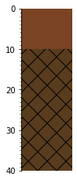

Data reading of the database
============================

A.Iragena supervised by Mr Kaufmann

.. code:: ipython3

    %matplotlib inline
    import matplotlib.pyplot as plt
    import numpy as np
    
    import sqlite3 
    from sqlite3 import Error

Import of the striplog object
~~~~~~~~~~~~~~~~~~~~~~~~~~~~~

It's important to check in the striplog folder where are the different
objects in order to import them correctly. The following command can be
used to check if the python goes in the right folder : echo $PYTHONPATH

.. code:: ipython3

    from striplog.striplog import Striplog, Legend, Interval, Component
    from striplog.position import Position
    from striplog.lexicon import Lexicon

.. code:: ipython3

    def create_connection(db_file):
        """ create a database connection to the SQLite database
            specified by the db_file
        :param db_file: database file
        :return: Connection object or None
        """
        conn = None
        try:
            conn = sqlite3.connect(db_file)
        except Error as e:
            print(e)
     
        return conn
     

.. code:: ipython3

    def select_datat_of_db(conn,table):
        """
        Query all rows in the tasks table
        :param conn: the Connection object
        :return:
        """
        cur = conn.cursor()
        cur.execute(table)
     
        rows = cur.fetchall()
        #result = [dict(row) for row in cur.fetchall()]
        for row in rows:
            print(row)
        return(rows)
        #return(result)

.. code:: ipython3

    database = r"project_database.db"

Create a database connection & import the data from the database
~~~~~~~~~~~~~~~~~~~~~~~~~~~~~~~~~~~~~~~~~~~~~~~~~~~~~~~~~~~~~~~~

.. code:: ipython3

    import pandas as pd

The code below read the database and put the data in the dataframe dfs

.. code:: ipython3

    conn = create_connection(database)
    tables = ['Boreholes', 'Components', 'Intervals', 'Lexicon'] # table names in the database
    dfs = {}
    with conn:    
        for i in tables:    
            print("---{table:s} data--- ".format(table=i))
            sql_cmd = "SELECT * FROM {table:s}".format(table=i) # to select the data of the table Boreholes
            dfs.update({i:  pd.read_sql(sql_cmd, conn)})

.. parsed-literal::

    ---Boreholes data--- 
    ---Components data--- 
    ---Intervals data--- 
    ---Lexicon data--- 

Defining of legend
~~~~~~~~~~~~~~~~~~

.. code:: ipython3

    new_legend="legend_GSDMA.csv"  # A specific legend has been created which in islegend_GSDMA.csv
    my_legend = Legend.from_csv(filename=new_legend)
    legend = Legend.builtin('NSDOE')
    lexicon = Lexicon.default()
    
    #legend = Legend.builtin('GSDMA') 
    #print(my_legend)

Creation of the striplog object for 1 borehole with the fonction "build\_strip\_from\_list"
~~~~~~~~~~~~~~~~~~~~~~~~~~~~~~~~~~~~~~~~~~~~~~~~~~~~~~~~~~~~~~~~~~~~~~~~~~~~~~~~~~~~~~~~~~~

.. code:: ipython3

    def build_strip_from_list(bh_test):
        bh1_strip = []  # striplog object 
        intervals = dfs['Intervals'].query('borehole=="{borehole:s}"'.format(borehole=bh_test))[['top','base', 'description']]
        for row in intervals.iterrows():
            components = dfs['Components'].query('borehole=="{borehole:s}" and top=={top:f} and base=={base:f}'.format(borehole=bh_test, top=row[1]['top'], base=row[1]['base']))
            components_dict={}
            for r in components.iterrows():
                components_dict.update({r[1]['key']:r[1]['value']})
            bh1_strip.append(Interval(**{'top': Position(middle=row[1]['top'], units='m'), 
                                    'base': Position(middle=row[1]['base'], units='m'),
                                    'description': row[1]['description'], 'components': [Component(properties=components_dict)]}))
        return(bh1_strip)

The following cell shows the display of the boreholes F10 and F11

.. code:: ipython3

    bh_test = 'F10'
    strp1=Striplog(build_strip_from_list(bh_test))
    strp1.plot(my_legend, ladder=True, aspect=2)
    
    bh_test = 'F11'
    strp1=Striplog(build_strip_from_list(bh_test))
    strp1.plot(my_legend, ladder=True, aspect=2)
    
    my_legend.plot() # pour afficher la légende

.. image:: output_16_1.png

.. code:: ipython3

    bh_test = 'F15'
    strp=Striplog(build_strip_from_list(bh_test))
    strp.plot(my_legend, ladder=True, aspect=2)
    my_legend.plot() # pour afficher la légende

.. image:: output_17_1.png

.. code:: ipython3

    print(strp)

.. parsed-literal::

    {'top': Position({'middle': 0.0, 'upper': 0.0, 'lower': 0.0, 'units': 'm'}), 'base': Position({'middle': 1.5, 'units': 'm'}), 'description': 'remblais non-saturés', 'data': {}, 'components': [Component({'lithology': 'silt', 'colour': 'gris'})]}
    {'top': Position({'middle': 1.5, 'units': 'm'}), 'base': Position({'middle': 4.0, 'units': 'm'}), 'description': 'remblais saturés', 'data': {}, 'components': [Component({'lithology': 'remblais', 'colour': 'ocre'})]}
    {'top': Position({'middle': 4.0, 'units': 'm'}), 'base': Position({'middle': 6.0, 'units': 'm'}), 'description': 'alluvions', 'data': {}, 'components': [Component({'lithology': 'silt', 'colour': 'gris'})]}

Manipulation of the dataframe
~~~~~~~~~~~~~~~~~~~~~~~~~~~~~

.. code:: ipython3

    #dfs['Intervals'] # just to check if the content of Intervals table is correct

.. raw:: html

    

    
    <table border="1" class="dataframe">
      <thead>
        <tr style="text-align: right;">
          <th></th>
          <th>borehole</th>
          <th>top</th>
          <th>base</th>
          <th>description</th>
        </tr>
      </thead>
      <tbody>
        <tr>
          <th>0</th>
          <td>F10</td>
          <td>0.0</td>
          <td>1.5</td>
          <td>remblais non-saturés</td>
        </tr>
        <tr>
          <th>1</th>
          <td>F10</td>
          <td>1.5</td>
          <td>4.0</td>
          <td>remblais saturés</td>
        </tr>
        <tr>
          <th>2</th>
          <td>F10</td>
          <td>4.0</td>
          <td>6.0</td>
          <td>alluvions</td>
        </tr>
        <tr>
          <th>3</th>
          <td>F11</td>
          <td>0.0</td>
          <td>1.5</td>
          <td>remblais non-saturés</td>
        </tr>
        <tr>
          <th>4</th>
          <td>F11</td>
          <td>1.5</td>
          <td>4.0</td>
          <td>remblais saturés</td>
        </tr>
        <tr>
          <th>5</th>
          <td>F11</td>
          <td>4.0</td>
          <td>6.0</td>
          <td>alluvions</td>
        </tr>
        <tr>
          <th>6</th>
          <td>F12</td>
          <td>0.0</td>
          <td>1.5</td>
          <td>remblais non-saturés</td>
        </tr>
        <tr>
          <th>7</th>
          <td>F12</td>
          <td>1.5</td>
          <td>4.0</td>
          <td>remblais saturés</td>
        </tr>
        <tr>
          <th>8</th>
          <td>F12</td>
          <td>4.0</td>
          <td>6.0</td>
          <td>alluvions</td>
        </tr>
        <tr>
          <th>9</th>
          <td>F13</td>
          <td>0.0</td>
          <td>1.5</td>
          <td>remblais non-saturés</td>
        </tr>
        <tr>
          <th>10</th>
          <td>F13</td>
          <td>1.5</td>
          <td>4.0</td>
          <td>remblais saturés</td>
        </tr>
        <tr>
          <th>11</th>
          <td>F13</td>
          <td>4.0</td>
          <td>6.0</td>
          <td>alluvions</td>
        </tr>
        <tr>
          <th>12</th>
          <td>F14</td>
          <td>0.0</td>
          <td>1.5</td>
          <td>remblais non-saturés</td>
        </tr>
        <tr>
          <th>13</th>
          <td>F14</td>
          <td>1.5</td>
          <td>4.0</td>
          <td>remblais saturés</td>
        </tr>
        <tr>
          <th>14</th>
          <td>F14</td>
          <td>4.0</td>
          <td>6.0</td>
          <td>alluvions</td>
        </tr>
        <tr>
          <th>15</th>
          <td>F15</td>
          <td>0.0</td>
          <td>1.5</td>
          <td>remblais non-saturés</td>
        </tr>
        <tr>
          <th>16</th>
          <td>F15</td>
          <td>1.5</td>
          <td>4.0</td>
          <td>remblais saturés</td>
        </tr>
        <tr>
          <th>17</th>
          <td>F15</td>
          <td>4.0</td>
          <td>6.0</td>
          <td>alluvions</td>
        </tr>
        <tr>
          <th>18</th>
          <td>F16</td>
          <td>0.0</td>
          <td>1.5</td>
          <td>remblais non-saturés</td>
        </tr>
        <tr>
          <th>19</th>
          <td>F16</td>
          <td>1.5</td>
          <td>4.0</td>
          <td>remblais saturés</td>
        </tr>
        <tr>
          <th>20</th>
          <td>F16</td>
          <td>4.0</td>
          <td>6.0</td>
          <td>alluvions</td>
        </tr>
        <tr>
          <th>21</th>
          <td>F20</td>
          <td>0.0</td>
          <td>1.5</td>
          <td>remblais non-saturés</td>
        </tr>
        <tr>
          <th>22</th>
          <td>F20</td>
          <td>1.5</td>
          <td>4.0</td>
          <td>remblais saturés</td>
        </tr>
        <tr>
          <th>23</th>
          <td>F20</td>
          <td>4.0</td>
          <td>6.0</td>
          <td>alluvions</td>
        </tr>
        <tr>
          <th>24</th>
          <td>F21</td>
          <td>0.0</td>
          <td>1.5</td>
          <td>remblais non-saturés</td>
        </tr>
        <tr>
          <th>25</th>
          <td>F21</td>
          <td>1.5</td>
          <td>4.0</td>
          <td>remblais saturés</td>
        </tr>
        <tr>
          <th>26</th>
          <td>F21</td>
          <td>4.0</td>
          <td>6.0</td>
          <td>alluvions</td>
        </tr>
        <tr>
          <th>27</th>
          <td>F22</td>
          <td>0.0</td>
          <td>1.5</td>
          <td>remblais non-saturés</td>
        </tr>
        <tr>
          <th>28</th>
          <td>F22</td>
          <td>1.5</td>
          <td>4.0</td>
          <td>remblais saturés</td>
        </tr>
        <tr>
          <th>29</th>
          <td>F22</td>
          <td>4.0</td>
          <td>6.0</td>
          <td>alluvions</td>
        </tr>
        <tr>
          <th>30</th>
          <td>F23</td>
          <td>0.0</td>
          <td>1.5</td>
          <td>remblais non-saturés</td>
        </tr>
        <tr>
          <th>31</th>
          <td>F23</td>
          <td>1.5</td>
          <td>4.0</td>
          <td>remblais saturés</td>
        </tr>
        <tr>
          <th>32</th>
          <td>F23</td>
          <td>4.0</td>
          <td>6.0</td>
          <td>alluvions</td>
        </tr>
        <tr>
          <th>33</th>
          <td>F24</td>
          <td>0.0</td>
          <td>1.5</td>
          <td>remblais non-saturés</td>
        </tr>
        <tr>
          <th>34</th>
          <td>F24</td>
          <td>1.5</td>
          <td>4.0</td>
          <td>remblais saturés</td>
        </tr>
        <tr>
          <th>35</th>
          <td>F24</td>
          <td>4.0</td>
          <td>6.0</td>
          <td>alluvions</td>
        </tr>
        <tr>
          <th>36</th>
          <td>F25</td>
          <td>0.0</td>
          <td>1.5</td>
          <td>remblais non-saturés</td>
        </tr>
        <tr>
          <th>37</th>
          <td>F25</td>
          <td>1.5</td>
          <td>4.0</td>
          <td>remblais saturés</td>
        </tr>
        <tr>
          <th>38</th>
          <td>F25</td>
          <td>4.0</td>
          <td>6.0</td>
          <td>alluvions</td>
        </tr>
      </tbody>
    </table>
    

.. code:: ipython3

    dfs['Components'].query('borehole=="F25" and key=="colour"') # To look for the color of the bh F25, in Component table

.. raw:: html

    

    
    <table border="1" class="dataframe">
      <thead>
        <tr style="text-align: right;">
          <th></th>
          <th>borehole</th>
          <th>top</th>
          <th>base</th>
          <th>key</th>
          <th>value</th>
        </tr>
      </thead>
      <tbody>
        <tr>
          <th>73</th>
          <td>F25</td>
          <td>0.0</td>
          <td>1.5</td>
          <td>colour</td>
          <td>brun</td>
        </tr>
        <tr>
          <th>75</th>
          <td>F25</td>
          <td>1.5</td>
          <td>4.0</td>
          <td>colour</td>
          <td>ocre</td>
        </tr>
        <tr>
          <th>77</th>
          <td>F25</td>
          <td>4.0</td>
          <td>6.0</td>
          <td>colour</td>
          <td>gris</td>
        </tr>
      </tbody>
    </table>
    

.. code:: ipython3

    dfs['Intervals'].head()

.. raw:: html

    

    
    <table border="1" class="dataframe">
      <thead>
        <tr style="text-align: right;">
          <th></th>
          <th>borehole</th>
          <th>top</th>
          <th>base</th>
          <th>description</th>
        </tr>
      </thead>
      <tbody>
        <tr>
          <th>0</th>
          <td>F10</td>
          <td>0.0</td>
          <td>1.5</td>
          <td>remblais non-saturés</td>
        </tr>
        <tr>
          <th>1</th>
          <td>F10</td>
          <td>1.5</td>
          <td>4.0</td>
          <td>remblais saturés</td>
        </tr>
        <tr>
          <th>2</th>
          <td>F10</td>
          <td>4.0</td>
          <td>6.0</td>
          <td>alluvions</td>
        </tr>
        <tr>
          <th>3</th>
          <td>F11</td>
          <td>0.0</td>
          <td>1.5</td>
          <td>remblais non-saturés</td>
        </tr>
        <tr>
          <th>4</th>
          <td>F11</td>
          <td>1.5</td>
          <td>4.0</td>
          <td>remblais saturés</td>
        </tr>
      </tbody>
    </table>
    

.. code:: ipython3

    dfs['Components'].head()

.. raw:: html

    

    
    <table border="1" class="dataframe">
      <thead>
        <tr style="text-align: right;">
          <th></th>
          <th>borehole</th>
          <th>top</th>
          <th>base</th>
          <th>key</th>
          <th>value</th>
        </tr>
      </thead>
      <tbody>
        <tr>
          <th>0</th>
          <td>F10</td>
          <td>0.0</td>
          <td>1.5</td>
          <td>lithology</td>
          <td>remblais</td>
        </tr>
        <tr>
          <th>1</th>
          <td>F10</td>
          <td>0.0</td>
          <td>1.5</td>
          <td>colour</td>
          <td>brun</td>
        </tr>
        <tr>
          <th>2</th>
          <td>F10</td>
          <td>1.5</td>
          <td>4.0</td>
          <td>lithology</td>
          <td>remblais</td>
        </tr>
        <tr>
          <th>3</th>
          <td>F10</td>
          <td>1.5</td>
          <td>4.0</td>
          <td>colour</td>
          <td>ocre</td>
        </tr>
        <tr>
          <th>4</th>
          <td>F10</td>
          <td>4.0</td>
          <td>6.0</td>
          <td>lithology</td>
          <td>silt</td>
        </tr>
      </tbody>
    </table>
    

.. code:: ipython3

    bh_test = 'F10'
    dfs['Intervals'].query('borehole=="{borehole:s}"'.format(borehole=bh_test)) # show all the intervals of bh_test

.. raw:: html

    

    
    <table border="1" class="dataframe">
      <thead>
        <tr style="text-align: right;">
          <th></th>
          <th>borehole</th>
          <th>top</th>
          <th>base</th>
          <th>description</th>
        </tr>
      </thead>
      <tbody>
        <tr>
          <th>0</th>
          <td>F10</td>
          <td>0.0</td>
          <td>1.5</td>
          <td>remblais non-saturés</td>
        </tr>
        <tr>
          <th>1</th>
          <td>F10</td>
          <td>1.5</td>
          <td>4.0</td>
          <td>remblais saturés</td>
        </tr>
        <tr>
          <th>2</th>
          <td>F10</td>
          <td>4.0</td>
          <td>6.0</td>
          <td>alluvions</td>
        </tr>
      </tbody>
    </table>
    

.. code:: ipython3

    # bh_test = 'F10'
    # dfs['Intervals'].query('borehole=="{borehole:s}"'.format(borehole=bh_test))['top'] # Only shows the column 'Top' for bh_test

.. parsed-literal::

    0    0.0
    1    1.5
    2    4.0
    Name: top, dtype: float64

.. code:: ipython3

    bh_strip

.. parsed-literal::

    [{'top': Position({'middle': 0.0, 'upper': 0.0, 'lower': 0.0, 'units': 'm'}),
      'base': Position({'middle': 1.5, 'units': 'm'}),
      'description': 'remblais non-saturés',
      'components': [Component({'lithology': 'remblais', 'colour': 'brun'})]},
     {'top': Position({'middle': 1.5, 'units': 'm'}),
      'base': Position({'middle': 4.0, 'units': 'm'}),
      'description': 'remblais saturés',
      'components': [Component({'lithology': 'remblais', 'colour': 'ocre'})]},
     {'top': Position({'middle': 4.0, 'units': 'm'}),
      'base': Position({'middle': 6.0, 'units': 'm'}),
      'description': 'alluvions',
      'components': [Component({'lithology': 'silt', 'colour': 'gris'})]}]

.. code:: ipython3

    for bh_row in dfs['Boreholes'].iterrows():
        print(bh_row[1][0])

.. parsed-literal::

    F10
    F11
    F12
    F13
    F14
    F15
    F16
    F20
    F21
    F22
    F23
    F24
    F25

Complete extraction of boreholes from the database (another way)
~~~~~~~~~~~~~~~~~~~~~~~~~~~~~~~~~~~~~~~~~~~~~~~~~~~~~~~~~~~~~~~~

.. code:: ipython3

    # BON !!!
    bhs_striplog = {}
    for bh_row in dfs['Boreholes'].iterrows(): # For all bh
        bh_strip = []
        intervals = dfs['Intervals'].query('borehole=="{borehole:s}"'.format(borehole=bh_row[1][0]))[['top','base', 'description']] # Look for the interval for the bh
        for row in intervals.iterrows():
            components = dfs['Components'].query('borehole=="{borehole:s}" and top=={top:f} and base=={base:f}'.format(borehole=bh_test, top=row[1]['top'], base=row[1]['base']))
            components_dict={}
            for r in components.iterrows():
                components_dict.update({r[1]['key']:r[1]['value']})
            bh_strip.append({'top': Position(middle=row[1]['top'], units='m'), 
                  'base': Position(middle=row[1]['base'], units='m'),
                  'description': row[1]['description'], 'components': [Component(components_dict)]})
        
        bhs_striplog.update({bh_row[1][0]: bh_strip})

.. code:: ipython3

    bh_test = 'F10'
    bh_strip = []  # striplog object 
    intervals = dfs['Intervals'].query('borehole=="{borehole:s}"'.format(borehole=bh_test))[['top','base', 'description']]
    for row in intervals.iterrows():
        components = dfs['Components'].query('borehole=="{borehole:s}" and top=={top:f} and base=={base:f}'.format(borehole=bh_test, top=row[1]['top'], base=row[1]['base']))
        components_dict={}
        for r in components.iterrows():
            components_dict.update({r[1]['key']:r[1]['value']})
        bh_strip.append({'top': Position(middle=row[1]['top'], units='m'), 
              'base': Position(middle=row[1]['base'], units='m'),
              'description': row[1]['description'], 'components': [Component(properties=components_dict)]})

.. code:: ipython3

    #Version modifiée   ---------------------------------------------------------
    bh_test = 'F10'
    bh1_strip = []  # striplog object 
    intervals = dfs['Intervals'].query('borehole=="{borehole:s}"'.format(borehole=bh_test))[['top','base', 'description']]
    for row in intervals.iterrows():
        components = dfs['Components'].query('borehole=="{borehole:s}" and top=={top:f} and base=={base:f}'.format(borehole=bh_test, top=row[1]['top'], base=row[1]['base']))
        components_dict={}
        for r in components.iterrows():
            components_dict.update({r[1]['key']:r[1]['value']})
        bh1_strip.append(Interval(**{'top': Position(middle=row[1]['top'], units='m'), 
                                'base': Position(middle=row[1]['base'], units='m'),
                                'description': row[1]['description'], 'components': [Component(properties=components_dict)]}))
            
    #     bh1_strip.append({'top': Position(middle=row[1]['top'], units='m'), 
    #           'base': Position(middle=row[1]['base'], units='m'),
    #           'description': row[1]['description'], 'components': [Component(components_dict)]})

.. code:: ipython3

    bh1_strip

.. parsed-literal::

    [Interval({'top': Position({'middle': 0.0, 'upper': 0.0, 'lower': 0.0, 'units': 'm'}), 'base': Position({'middle': 1.5, 'units': 'm'}), 'description': 'remblais non-saturés', 'data': {}, 'components': [Component({'lithology': 'remblais', 'colour': 'brun'})]}),
     Interval({'top': Position({'middle': 1.5, 'units': 'm'}), 'base': Position({'middle': 4.0, 'units': 'm'}), 'description': 'remblais saturés', 'data': {}, 'components': [Component({'lithology': 'remblais', 'colour': 'ocre'})]}),
     Interval({'top': Position({'middle': 4.0, 'units': 'm'}), 'base': Position({'middle': 6.0, 'units': 'm'}), 'description': 'alluvions', 'data': {}, 'components': [Component({'lithology': 'silt', 'colour': 'gris'})]})]

.. code:: ipython3

    bh_test = 'F10'
    strp=Striplog(build_strip_from_list(bh_test))
    s_striplog=Striplog(bh1_strip)
    s_striplog.plot(my_legend, ladder=True, aspect=2)
    my_legend.plot() # pour afficher la légende

.. image:: output_33_0.png

.. image:: output_33_1.png

Test fonctionnel
================

.. code:: ipython3

    #Modifié
    bhs_striplog = {}
    bh1_strip = []
    for bh_row in dfs['Boreholes'].iterrows(): # For all bh
        bh_strip = []
        intervals = dfs['Intervals'].query('borehole=="{borehole:s}"'.format(borehole=bh_row[1][0]))[['top','base', 'description']] # Look for the interval for the bh
        for row in intervals.iterrows():
            components = dfs['Components'].query('borehole=="{borehole:s}" and top=={top:f} and base=={base:f}'.format(borehole=bh_row[1][0], top=row[1]['top'], base=row[1]['base'])) # Look for components of the bh
            components_dict={}
            for r in components.iterrows():
                components_dict.update({r[1]['key']:r[1]['value']})
                components_dict.update({r[1]['key']:r[1]['value']})
            bh1_strip.append(Interval(**{'top': Position(middle=row[1]['top'], units='m'), 
                'base': Position(middle=row[1]['base'], units='m'),
                'description': row[1]['description'],'data': {}, 'components': [Component(properties=components_dict)]})

.. code:: ipython3

    bh_test = 'F10'
    strp=Striplog(build_strip_from_list(bh_test))

::

    ---------------------------------------------------------------------------

    AttributeError                            Traceback (most recent call last)

    <ipython-input-99-16a4b1004625> in <module>
          1 bh_test = 'F10'
    ----> 2 strp=Striplog(build_strip_from_list(bh_test))
    

    ~/GSDMA2019/striplog/striplog.py in __init__(self, list_of_Intervals, source, order)
         58         if order.lower()[0] == 'a':  # Auto
         59             # If bases == tops, then this is a bunch of 'points'.
    ---> 60             if all([iv.base.z == iv.top.z for iv in list_of_Intervals]):
         61                 order = 'none'
         62                 self.order = 'none'

    ~/GSDMA2019/striplog/striplog.py in <listcomp>(.0)
         58         if order.lower()[0] == 'a':  # Auto
         59             # If bases == tops, then this is a bunch of 'points'.
    ---> 60             if all([iv.base.z == iv.top.z for iv in list_of_Intervals]):
         61                 order = 'none'
         62                 self.order = 'none'

    AttributeError: 'dict' object has no attribute 'base'

.. code:: ipython3

    #Extraction of 1 borehole to create a striplog   ---------------------------------------------------------
    bh_test = 'F10'
    bh1_strip = []  # striplog object 
    intervals = dfs['Intervals'].query('borehole=="{borehole:s}"'.format(borehole=bh_test))[['top','base', 'description']]
    for row in intervals.iterrows():
        components = dfs['Components'].query('borehole=="{borehole:s}" and top=={top:f} and base=={base:f}'.format(borehole=bh_test, top=row[1]['top'], base=row[1]['base']))
        components_dict={}
        for r in components.iterrows():
            components_dict.update({r[1]['key']:r[1]['value']})
        bh1_strip.append(Interval(**{'top': Position(middle=row[1]['top'], units='m'), 
                                'base': Position(middle=row[1]['base'], units='m'),
                                'description': row[1]['description'], 'components': [Component(properties=components_dict)]}))
            
    #     bh1_strip.append({'top': Position(middle=row[1]['top'], units='m'), 
    #           'base': Position(middle=row[1]['base'], units='m'),
    #           'description': row[1]['description'], 'components': [Component(components_dict)]})

::

    ---------------------------------------------------------------------------

    NameError                                 Traceback (most recent call last)

    <ipython-input-21-a477b764e354> in <module>
          2 bh_test = 'F10'
          3 bh1_strip = []  # striplog object
    ----> 4 intervals = dfs['Intervals'].query('borehole=="{borehole:s}"'.format(borehole=bh_test))[['top','base', 'description']]
          5 for row in intervals.iterrows():
          6     components = dfs['Components'].query('borehole=="{borehole:s}" and top=={top:f} and base=={base:f}'.format(borehole=bh_test, top=row[1]['top'], base=row[1]['base']))

    NameError: name 'dfs' is not defined

.. code:: ipython3

    bh1_strip = []  # striplog object 
    for bh_row in dfs['Boreholes'].iterrows(): # For all bh
        intervals = dfs['Intervals'].query('borehole=="{borehole:s}"'.format(borehole=bh_row))[['top','base', 'description']]
        ?intervals

::

    ---------------------------------------------------------------------------

    TypeError                                 Traceback (most recent call last)

    <ipython-input-61-568d05059993> in <module>
          1 bh1_strip = []  # striplog object
          2 for bh_row in dfs['Boreholes'].iterrows(): # For all bh
    ----> 3     intervals = dfs['Intervals'].query('borehole=="{borehole:s}"'.format(borehole=bh_row))[['top','base', 'description']]
          4     get_ipython().run_line_magic('pinfo', 'intervals')

    TypeError: unsupported format string passed to tuple.__format__

.. code:: ipython3

    ?intervals

.. code:: ipython3

    #bh_test = 'F10'
    bh1_strip = []  # striplog object 
    for bh_row in dfs['Boreholes'].iterrows(): # For all bh
        intervals = dfs['Intervals'].query('borehole=="{borehole:s}"'.format(borehole=bh_row))[['top','base', 'description']]
        for row in intervals.iterrows():
            components = dfs['Components'].query('borehole=="{borehole:s}" and top=={top:f} and base=={base:f}'.format(borehole=bh_row, top=row[1]['top'], base=row[1]['base']))
            components_dict={}
            for r in components.iterrows():
                components_dict.update({r[1]['key']:r[1]['value']})
            bh1_strip.append(Interval(**{'top': Position(middle=row[1]['top'], units='m'), 
                                    'base': Position(middle=row[1]['base'], units='m'),
                                    'description': row[1]['description'], 'components': [Component(properties=components_dict)]}))
        bhs_striplog.update({bh_row[1][0]: bh_strip[1][0]})

::

    ---------------------------------------------------------------------------

    TypeError                                 Traceback (most recent call last)

    <ipython-input-57-0d03199d657a> in <module>
          2 bh1_strip = []  # striplog object
          3 for bh_row in dfs['Boreholes'].iterrows(): # For all bh
    ----> 4     intervals = dfs['Intervals'].query('borehole=="{borehole:s}"'.format(borehole=bh_row))[['top','base', 'description']]
          5     for row in intervals.iterrows():
          6         components = dfs['Components'].query('borehole=="{borehole:s}" and top=={top:f} and base=={base:f}'.format(borehole=bh_row, top=row[1]['top'], base=row[1]['base']))

    TypeError: unsupported format string passed to tuple.__format__

.. code:: ipython3

    #bhs_striplog
    bh1_strip

::

    ---------------------------------------------------------------------------

    NameError                                 Traceback (most recent call last)

    <ipython-input-16-bc14b62b9f0f> in <module>
          1 #bhs_striplog
    ----> 2 bh1_strip
    

    NameError: name 'bh1_strip' is not defined

.. code:: ipython3

    s_to_plot="F10"                  # Nom du bh à plotter avec striplog
    s_list=bhs_striplog['F10']  # List d'intervalles du bh: s_to_plot
    
    s_striplog=Striplog(bh1_strip)
    s_striplog.plot(my_legend, ladder=True, aspect=2)
    my_legend.plot() # pour afficher la légende
    
    
    #  s_striplog=Striplog.__init__(None,i, source=None, order='auto') # conversion en object striplog

::

    ---------------------------------------------------------------------------

    KeyError                                  Traceback (most recent call last)

    <ipython-input-72-492306eda9d4> in <module>
          1 s_to_plot="F10"                  # Nom du bh à plotter avec striplog
    ----> 2 s_list=bhs_striplog['F10']  # List d'intervalles du bh: s_to_plot
          3 
          4 s_striplog=Striplog(bh1_strip)
          5 s_striplog.plot(my_legend, ladder=True, aspect=2)

    KeyError: 'F10'

.. code:: ipython3

    s_to_plot="F10"                  # Nom du bh à plotter avec striplog
    s_list=bhs_striplog['F10']  # List d'intervalles du bh: s_to_plot
    intvls=[]
    for i in s_list:
        intvls.append(Interval(s_list[i]))

::

    ---------------------------------------------------------------------------

    TypeError                                 Traceback (most recent call last)

    <ipython-input-74-dd49356e9c22> in <module>
          3 intvls=[]
          4 for i in s_list:
    ----> 5     intvls.append(Interval(s_list[i]))
    

    TypeError: list indices must be integers or slices, not dict

.. code:: ipython3

    s_list
    
    #  s_striplog=Striplog.__init__(None,i, source=None, order='auto') # conversion en object striplog

.. code:: ipython3

    i4 = Interval(top=0, base=10, components=[Component({'lithology': 'none','colour': 'rouille'})]) #selon my_legend
    i3 = Interval(top=10, base=40, components=[Component({'lithology': 'remblais','colour': 'brun'})]) #selon my_legend
    i1 = Interval(top=0, base=20, components=[Component({'lithology': 'limestone'})])
    i2 = Interval(top=20, base=60, components=[Component({'lithology': 'shale'})])
    i=[i3,i4]
    
    
    s_striplog=Striplog(i)
    s_striplog.plot(my_legend, ladder=True, aspect=2)
    my_legend.plot() # pour afficher la légende
    

.. image:: output_45_1.png

Add lexicon
-----------

.. code:: ipython3

    dfs['lexicon']

.. code:: ipython3

    bh_strip.append(dfs['lexicon']) # Command to add smthg 

Structure of 1 interval of the striplog
^^^^^^^^^^^^^^^^^^^^^^^^^^^^^^^^^^^^^^^

{'top': Position({'middle': 51.24117647058824, 'units': 'm'}), 'base':
Position({'middle': 54.81764705882354, 'units': 'm'}), 'description':
'', 'data': {}, 'components': [Component({'lithology': 'sandstone',
'colour': 'grey', 'grainsize': 'vf-f'})]}

.. code:: ipython3

    bh_strip

.. code:: ipython3

    def from_sqlite_Row_to_dict(list_with_rows):
        ''' Turn a list with sqlite3.Row objects into a dictionary'''
        d ={} # the dictionary to be filled with the row data and to be returned
    
        for i, row in enumerate(list_with_rows): # iterate throw the sqlite3.Row objects            
            l = [] # for each Row use a separate list
            for col in range(0, len(row)): # copy over the row date (ie. column data) to a list
                l.append(row[col])
            d[i] = l # add the list to the dictionary   
        return d

.. code:: ipython3

    bhs_striplog = {}
    Intvll=[]
    for bh_row in dfs['Boreholes'].iterrows(): # For all bh
        bh_strip = []
        intervals = dfs['Intervals'].query('borehole=="{borehole:s}"'.format(borehole=bh_row[1][0]))[['top','base', 'description']] # Look for the interval for the bh
        component={}
        for row in intervals.iterrows():
            litho = dfs['Components'].query('borehole=="{borehole:s}" and top=={top:f} and base=={base:f} and key=="{key:s}"'.format(borehole=bh_test, top=row[1]['top'], base=row[1]['base'], key='lithology'))['value']
            color= dfs['Components'].query('borehole=="{borehole:s}" and top=={top:f} and base=={base:f} and key=="{key:s}"'.format(borehole=bh_test, top=row[1]['top'], base=row[1]['base'], key='colour'))['value']
            #print(litho)
    #         print(color)
            #litho=compnent['lithology'][0]
            #color=compnent['color'][0]
            #litho=compnent['value'][0]
            #color=compnent['value'][1]
            #components_dict={}
            #for r in components.iterrows():
                #components_dict.update({r[1]['key']:r[1]['value']})
        Intvll.append(Interval(top=row[1]['top'], base=row[1]['base'], description=row[1]['description'], components=[Component({'lithology':litho[4],'colour': color})]))
    #type(litho)
    print(color[4])
            

.. code:: ipython3

    dic=from_sqlite_Row_to_dict(comp)

.. code:: ipython3

    d['F10', ] 

.. code:: ipython3

    conn = create_connection(database)
    with conn:    
            
        print("---BOREHOLES data--- ")
        table_bh="SELECT * FROM Boreholes" # to select the data of the table Boreholes
        bh=select_datat_of_db(conn,table_bh)
        
        print("---COMPONENTS data--- ")
        table_comp="SELECT * FROM Component" # to select the data of the table component
        comp=select_datat_of_db(conn,table_comp)
        
        print("---INTERVAL data--- ")
        table_int="SELECT * FROM Intervals" # to select the data of the table Intervals
        intvl=select_datat_of_db(conn,table_int)
        
        print("---LEXICON--- ")
        table_lex="SELECT * FROM lexicon" # to select the data of the table Intervals
        lex=select_datat_of_db(conn,table_lex)
        
        
     

df=components.loc[4:6,['Key', 'Value']]
df

components_dict={}
for r in df.iterrows():
    components_dict.update({r[1]['Key']:r[1]['Value']})

# My method to create the striplog
strip={{'top': Position(middle=intvl[0][1], units='m'), 
       'base': Position(middle=intvl[0][2], units='m'),
       'description': '', 'data': {intvl[0][3]},
       'components': [Component({'lithology': litho, 'colour': col, 'grainsize': '/'})]}}

strip = [{'top': Position(middle=intvl[0][1], units='m'), 
          'base': Position(middle=intvl[0][2], units='m'),
          'description': '', 'data': {intvl[0][3]}, 'components': [Component({'lithology':'sand', 'color': 'red'})]}]
strip_F25 = [{'top': Position(middle=intvl[0][1], units='m'), 
          'base': Position(middle=intvl[0][2], units='m'),
          'description': '', 'data': {intvl[0][3]}, 'components': [Component({'lithology':'sand', 'color': 'red'})]}]
          
if comp[0][0]==intvl[0][0]:
    if comp[0][1]==intvl[0][1]:
        if comp[0][2]==intvl[0][2]:
            if comp[0][3]=='lithology':
                litho=comp[0][4]
            if comp[1][3]=='colour':
                col=comp[1][4]
                

.. code:: ipython3

    conn = create_connection(database)
    with conn:    
            
        print("---BOREHOLES data--- ")
        table_bh="SELECT * FROM Boreholes" # to select the data of the table Boreholes
        bh=select_datat_of_db(conn,table_bh)
        
        print("---COMPONENTS data--- ")
        table_comp="SELECT * FROM Component" # to select the data of the table component
        comp=select_datat_of_db(conn,table_comp)
        
        print("---INTERVAL data--- ")
        table_int="SELECT * FROM Intervals" # to select the data of the table Intervals
        intvl=select_datat_of_db(conn,table_int)
        
        print("---LEXICON--- ")
        table_lex="SELECT * FROM lexicon" # to select the data of the table Intervals
        lex=select_datat_of_db(conn,table_lex)
     
     

.. code:: ipython3

    bh # is a list, cause it has brackets
    bh[0]
    lex
    type(intvl)
    intvl[0][0]
    bh[1][0]
    comp[1][4]
    lexicon=lex
