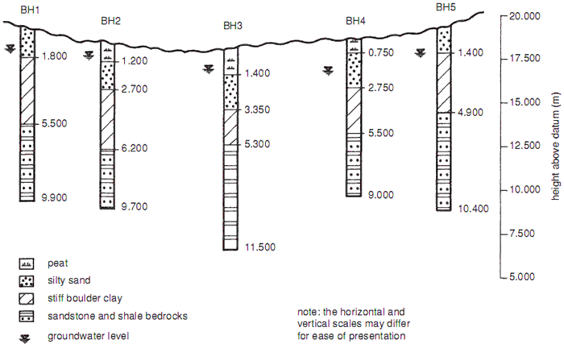

Extraction of the data on a polluted site
===========================================

The drawing below shows, what are boreholes.

Several boreholes are represented with the composition of the soil:

   
*Source :* http://www.abuildersengineer.com/2012/12/soil-samples-and-soil-proles.html
  
This is an example of what we would like to obtain from the data mesured on the polluted site.

The data mesured were registered in .txt file as represented below :

Borehole data  :
----------------

**Log_F10.txt** 

.. code-block:: 
   :linenos:
   
   # borehole name
   F10
   # borehole description
    start	end	description	lithology	color
    0.00	1.50	remblais non-saturés	remblais	brun
    1.50	4.00	remblais saturés	remblais	ocre
    4.00	6.00	alluvions	silt	gris
   # markers
    toit nappe	1.5
    mur remblais	4.0

Electrode data : 
-----------------

**F10.txt**
    
.. code-block:: 
   :linenos:
   
   # electrode string name
   F10
   # electrode string origin coordinates
   884.68	577.91	102.00
   # electrodes relative coordinates
   1	0.00	0.00	-5.92
   2	0.00	0.00	-4.92
   3	0.00	0.00	-3.92
   4	0.00	0.00	-2.92
   5	0.00	0.00	-1.92
   6	0.00	0.00	-0.92
   
   
.. ::
    # electrode string name
    F10
    # electrode string origin coordinates
    884.68	577.91	102.00
    # electrodes relative coordinates
    1	0.00	0.00	-5.92
    2	0.00	0.00	-4.92
    3	0.00	0.00	-3.92
    4	0.00	0.00	-2.92
    5	0.00	0.00	-1.92
    6	0.00	0.00	-0.92