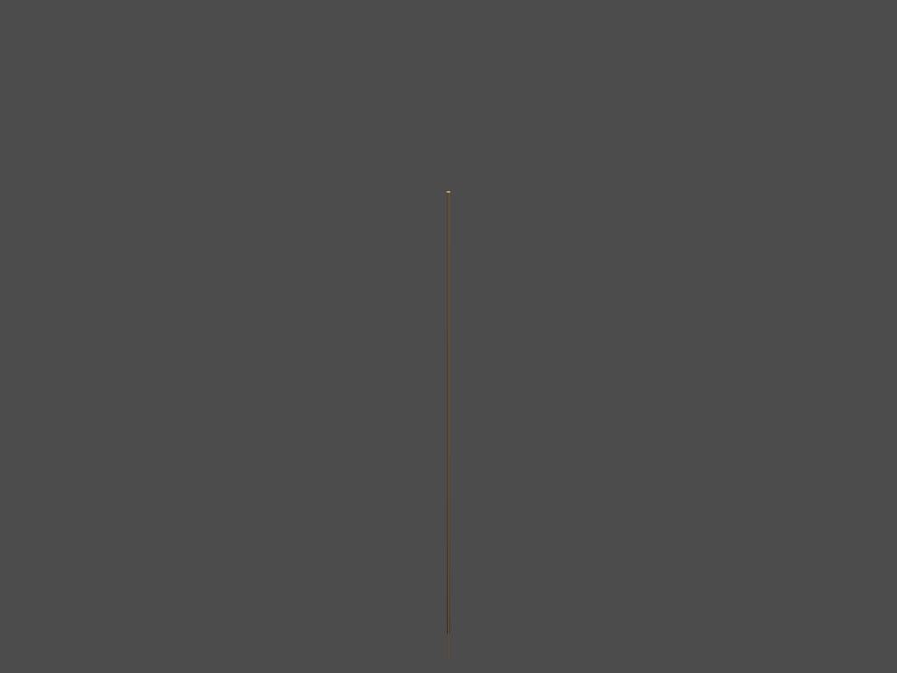

Display a Borehole from Striplog in PyVista
===========================================

Display all the intervals in a random way with the correct center and
height

.. code:: ipython3

    from striplog.striplog import Striplog
    import pyvista as pv
    import pandas as pd
    import scipy

Striplog Object
---------------

Create a Striplog Object from png
~~~~~~~~~~~~~~~~~~~~~~~~~~~~~~~~~

.. code:: ipython3

    from striplog import Legend, Lexicon, Interval, Component
    legend = Legend.builtin('NSDOE')
    lexicon = Lexicon.default()

.. code:: ipython3

    imgfile = "M-MG-70_14.3_135.9.png"
    strip = Striplog.from_img(imgfile, 14.3, 135.9, legend=legend)

.. parsed-literal::

    /home/gfa/.local/share/virtualenvs/GSDMA2019-F9ES6BKJ/lib/python3.6/site-packages/striplog/striplog.py:868: UserWarning: from_img() is deprecated; please use from_image()
      warnings.warn(w)

Add Multiple Intervals on the same plot
~~~~~~~~~~~~~~~~~~~~~~~~~~~~~~~~~~~~~~~

Creation of a list of intervals

.. code:: ipython3

    list_of_intervals = []
    for i in strip:
        list_of_intervals.append(i)

.. code:: ipython3

    def add_interval_list(intervals,plotter,radius=.09):
        """
        add a list of intervals to a plotter 
        :param intervals: list of intervals to add to the plotter 
        :type intervals: list
        :param plotter: plotter pyvista 
        :type plotter: pyvista.plotting.plotting.Plotter
        :param radius: radius of the boreholes (if different radii, make distinct lists of intervals)
        :type radius: float
        """    
        cylinders = []
        i = 0
        for interval in intervals:
            
            i = intervals.index(interval)
            
            center = (interval.base.middle - interval.top.middle)/2
            height = interval.base.middle - interval.top.middle
            
            cylinders.append( 
                        pv.Cylinder(
                                        center = center,
                                        height = height,
                                        direction = (0.0, 0.0, 1.0),
                                        radius = radius, 
                                        
                                      )
                            
                                )
        
            plotter.add_mesh(cylinders[i], color="tan", show_edges=False)
        print(2)
        print(type(plotter))
        print(type(radius))
        plotter.show(auto_close=False, use_panel=True)

Creation of the plotter

.. code:: ipython3

    plotter = pv.Plotter(shape=(1,1))

Use the function and display on the plotter

.. code:: ipython3

    add_interval_list(list_of_intervals, plotter)
    plotter.show(auto_close=False, use_panel=True)

.. parsed-literal::

    2
    <class 'pyvista.plotting.plotting.Plotter'>
    <class 'float'>

.. image:: output_14_1.png

