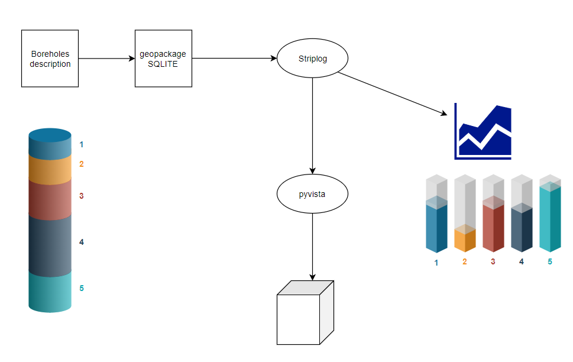

The project of GSDMA
====================
The purpose of this project is to use the data mesured by some electrodes on a polluted site and display it in 2D and 3D.

The following schema shows how the project of Geospatial data management and analysis were organized:

   

.. Redo the schema on Inkscape, developp it if necessary + explain it 