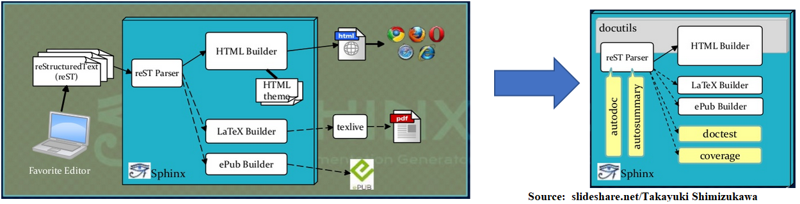
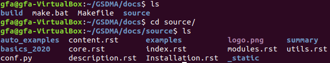
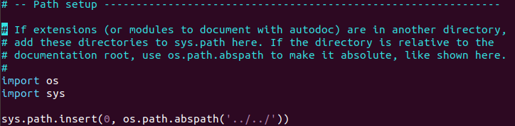
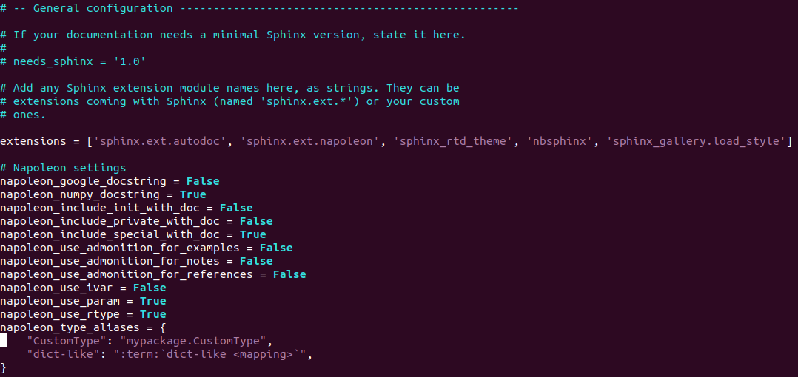
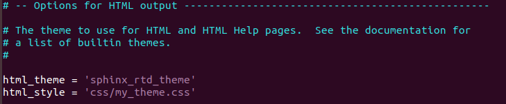
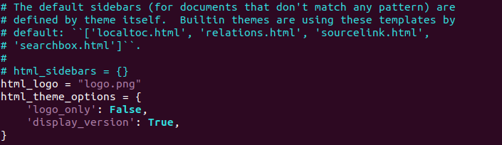

API documentation
====================

The work carried out in this project is in line with the need to make available to all scientists and/or developers a precise and accessible calculation tool. 
Understanding the structure of a documentation is a problem that all users are confronted to. Previous work has focused on the construction of an HTML page with
documentation of the source python codes.  However, significant limitations on the documentation model have been observed.  Notably in the difficulty to explore the HTML page, the attractiveness, organization
and structuring of the content in the table of contents. The choice of a documentation structure depends on the research objectives of the authors. 
Sphinx is a Open Source documentation generator that has been created to generate Python official library's documents. Therefore, Sphinx generates documentation as several
output formats from the reST text markup. 

The current structure of sphinx documentation has been built considering all development made for GSDMA project 2020. The architecture of GSDMA documentation is characterized by library files (utils.py), build output and scaffold files (conf.py & index.rst).

Generally, we needed to improve the style of  documentation project 2019. Four essential points on the documentation have been observed specially into Conf.py file.

General configuration
___________________________

**Path to produce an operational document**

The first step after starting the sphinx application has been created the folder will host the gobal documentation. We need to assign a path to automatically generate .rst files from the python source code.

An integration in the conf.py file of the extensions sphinx.ext. autodoc, napoleon, rtd_theme, nbshinx and gallery.load_style. These extensions allowed to make a  set of HTML pages from the .py modules (core and utils packages). Note that the core and utils packages must contain the modules (.py files) and the _init_.py file to avoid errors. 

**Options for HTML output**

A basic extension on the theme was chosen to obtain a style (sphinx_rtd_theme) and a preview (css/my_theme.css) of the HTML page of the project. 

**Insertion of the logo**

A image.png  must be included in the docs/source/ folder for the logo to be displayed on our HTML page.

