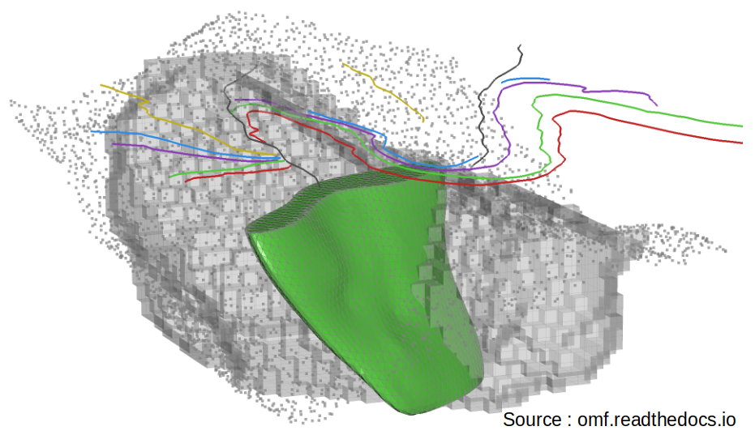

Principle
===================================

OMF
_____________________

OMF (Open Mining Format) is an open-source file format for 3D data interoperability in mining softwares. It has been developped by the Global Mining Guidelines Group (`GMG <https://gmggroup.org/gmg-developing-open-mining-format-omf-version-2-0/>`_) with the purpose to promote standardisation and data interchange accross the mining community.

OMF python package allows to create several type of data like points, lines, surfaces, volumes and include them in a project that can be export as an OMF file. 

GSDMA Borehole3D object
_____________________________________________

**Borehole3D** objects and its methods have been implemented to allow 3D representation of boreholes and the information collected along them. 

For achieving these purposes, firstly, the class has been developed by inheritance of **Striplog** object, in order to represent the geological layers intercepted by each borehole and to obtain a stratigraphic log for each of them. Then, for the 3D representation, it was necessary to create a link with a **Omf** object, by assigning to the **Borehole3D** object a geometry by using the *LineSetElement* class of omf. With this new property, the object is converted into a *vista.PolyData* vtk object using omfvista, and then plotted by using pyvista to get the 3D representation. Pyvista and omfvista are two python packages.

