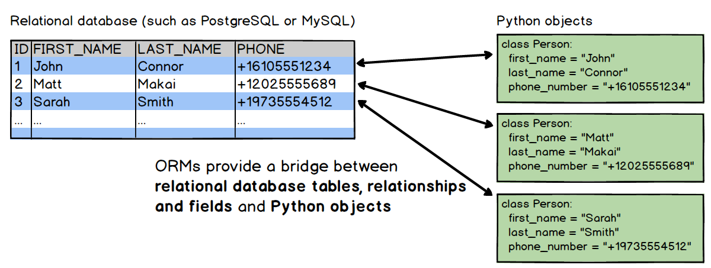

Principle
===================================

Reasons of implementing an object-relational mapper in the GSDMA project.
___________________________________________________________________________________
As presented in the summary chapter, the GSDMA project is based on the processing of borehole data and their representation. 

In 2019, the basic data implemented in the GSDMA project were 15 boreholes produced at the polluted site of the Marchienne-Au-Pont coking plant. The data related to these boreholes were recorded in .TXT files as follows: 

.. code:: python

 # borehole name
  F10
 # borehole description
  start       end     description             lithology       colour
  0.00        1.50    remblais non-saturés    remblais        brun
  1.50        4.00    remblais saturés        remblais        ocre
  4.00        6.00    alluvions               silt            gris
 # markers
  toit nappe      1.5
  mur remblais    4.0

The 2019 project was based on procedural programming using these data given by .txt files. 

They gathered those data into a SQLite database, in a specific organization, in 4 tables : Boreholes - Components - Intervals - Lexicon, with the format of Geopackage, which is a format for geospatial information. Then, the data were read and put into a specific structure called Striplog. Finally, from the striplog structure the data were displaying in 2D (using Striplog package) and in 3D (using PyVista package).

The problem is that this procedural programming has some defects:

 - The implementation of new drillings requires modifications to the code.
 - This programming is not very robust and a user can perform unwanted operations with the borehole data. 
 - The project is hardly applicable to other projects.

For these reasons, it was necessary to implement object-oriented programming as soon as the input data was read and arranged into a database.

SQLAlchemy
_____________

We use SQLAlchemy, a Python SQL toolkit, for its object-relational mapper (ORM).

The advantage of using an ORM is that it provides the data mapper pattern, where classes can be mapped to the database. The idea behind the ORM is shown in below_. 

.. _below:

The object's classes are implemented with specific instruction. The mapper develop the database schema on the basis of the classes. 

Classes are associate to a table in the database and the attributes of the class represent fields into the table. 

Thus each object defined on the basis of the class and holding its attributes can be easily added to the database. The ORM’s engine used to add objects to the database is the Session object based on the Session class of SQLAlchemy. This addition can also be implemented by the session object in a procedural or object-oriented way (via a class instruction).

The relationship between tables (one-to-one, one-to-many, etc.) are implemented in the classes where relationship are defined between each other.

