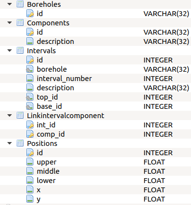
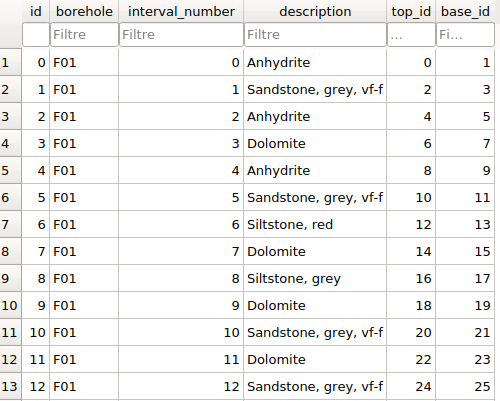
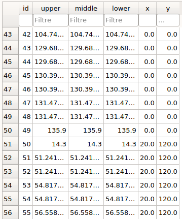
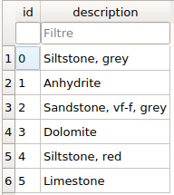

The final database in GSDMA 2020 release
==============================================

The structure of the database
---------------------------------

The final structure of the database_ is shown in the figure below.

The database tables are formed by the different classes and the tables fields are formed by the attributes of the classes presented in the tab `Building ORM classes <orm_classes.rst>`_.

.. _database:

The structure of the Interval table
---------------------------------------

Below is presented the Interval table with data loaded from a LAS file and added by the project class specifically for this presentation.

.. _Intervals:

The structure of the Position table
---------------------------------------

Below is presented the Position table with data loaded from a LAS file and added by the project class specifically for this presentation.

.. _Positions:

The structure of the Component table
---------------------------------------

Below is presented the Component table with data loaded from a LAS file and added by the project class specifically for this presentation.

.. _Component:

