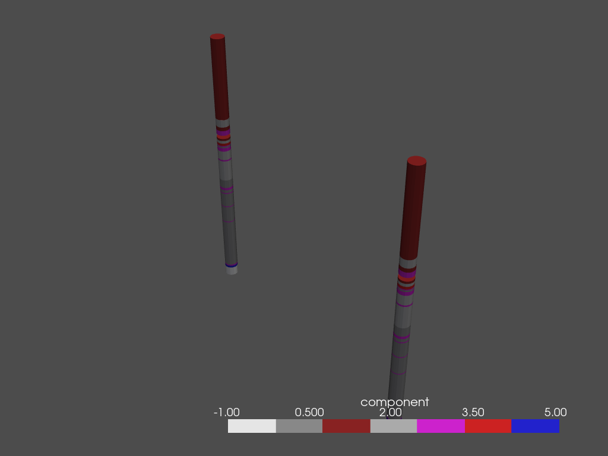

ORM and OMF in a single project
===================================

As presented in the OMF development and ORM development sections, 2 main objects have been developed for the representation of borehole information: the **BoreholeORM** (ORM) and **Borehole3D** (OMF) classes. The BoreholeORM object has been developed in order to be able to integrate the data of each borehole in a database, while the Borehole3D object has allowed the representation of this information in the form of 2D and 3D stratigraphic logs.

As the objective of the GSDMA project was to represent several boreholes data on a contaminated site, the BoreholeORM and Borehole3D objects had to be used concomitantly in a single project that could be properly managed. For this purpose, the **Project** class has been developed in order to add and update boreholes, but also to display all of them in a single 3D view (see the image below). This has been possible via Project class methods : `refresh()`_, `add_components()`_, `add_borehole()`_, `plot3d()`_. 

The project class constitutes the core of the project.

.. code:: python

    class Project:
    """
    Create a project that will contain Borehole object
    
    Attributes
    -----------
    session : ORM Session object
    name : str
    boreholes : list of BoreholeORM object
    boreholes_3d : list of Borehole3D object
    legend : Striplog Legend object

    Methods
    --------
    refresh(update_3d=false)
    add_borehole(self, bh)
    commit()
    add_components(self, components)
    plot3d(self, x3d=False)
        
    """
    
    def __init__(self, session, legend=None, name='new_project'):
        """
        Project class
        
        Parameters
        -----------
        session : ORM session object
        legend : bool
        name : str
        
        """
        
        self.session = session
        self.name = name
        self.boreholes = None
        self.boreholes_3d = None
        self.legend = legend
        self.refresh(update_3d=True)

Project class methods
---------------------------

.. _refresh() :

.. code:: python

    def refresh(self, update_3d=False):
        """
        read Boreholes in the database and updates 3D boreholes
        
        Parameters
        -----------
        update_3d : bool
            if True, updates Striplog/OMF 3D boreholes (default=True)
        """
        
        self.boreholes = self.session.query(BoreholeOrm).all()
        if update_3d:
            self.boreholes_3d = []
            for bh in self.boreholes:
                list_of_intervals = get_interval_list(bh)
                print(list_of_intervals)
                self.boreholes_3d.append(Borehole3D(intervals=list_of_intervals, legend=self.legend))

.. _commit() :

.. code:: python

    def commit(self):
        'Validate all modifications done in the project'
        self.session.commit()

.. _add_borehole() :

.. code:: python
       
    def add_borehole(self, bh):
        """
        Add a list of Boreholes to the project
        
        Parameters
        -----------
        bh : list
            list of Boreholes objects
            
        See Also
        ---------
        BoreholeORM : ORM borehole object
        Borehole3D : Striplog/OMF borehole object
        """
        
        self.session.add(bh)
        self.commit()
        self.refresh()
        list_of_intervals = get_interval_list(bh)
        self.boreholes_3d.append(Borehole3D(intervals=list_of_intervals, legend=self.legend))

.. _add_components() :

.. code:: python

    def add_components(self, components):
        """
        Add a list of Components to the project
        
        Parameters
        -----------
        Component : dict
            dict of Component objects
            
        See Also
        ---------
        Component : ORM Component object
        """
        
        for comp_id in components.keys():
            new_component = ComponentOrm(id=comp_id, description=components[comp_id].summary())
            self.session.add(new_component)
        self.commit()
        self.refresh()

.. _plot3d() :
.. code:: python

    def plot3d(self, x3d=False):
        """
        Returns an interactive 3D representation of all boreholes in the project
        
        Parameters
        -----------
        x3d : bool
            if True, generates a 3xd file of the 3D (default=False)
        """
        pl = pv.Plotter()
        for bh in self.boreholes_3d:
            bh.plot3d(plotter=pl)
        if not x3d:
            pl.show()
        else:
            writer = vtkX3DExporter()
            writer.SetInput(pl.renderer.GetRenderWindow())
            filename = f'project_{self.name:s}.x3d'
            writer.SetFileName(filename)
            writer.Update()
            writer.Write()
            x3d_html = f'<html>\n<head>\n    <meta http-equiv="X-UA-Compatible" content="IE=edge"/>\n' \
                       '<title>X3D scene</title>\n 
' \
                       '\n' \
                       '<link rel=\'stylesheet\' type=\'text/css\' href=\'http://www.x3dom.org/download/x3dom.css\'/>\n' \
                       '</head>\n<body>\n
\n For interaction, click in the view and press "a" to see the whole scene. For more info on interaction,' \
                       ' please read  <a href="https://doc.x3dom.org/tutorials/animationInteraction/navigation/index.html">the docs</a>  \n
\n' \
                       '<x3d width=\'968px\' height=\'600px\'>\n <scene>\n' \
                       '<viewpoint position="-1.94639 1.79771 -2.89271" orientation="0.03886 0.99185 0.12133 3.75685">' \
                       '</viewpoint>\n <Inline nameSpaceName="Borehole" mapDEFToID="true" url="' + filename + '" />\n' \
                       '</scene>\n</x3d>\n</body>\n</html>\n'
            return HTML(x3d_html)
