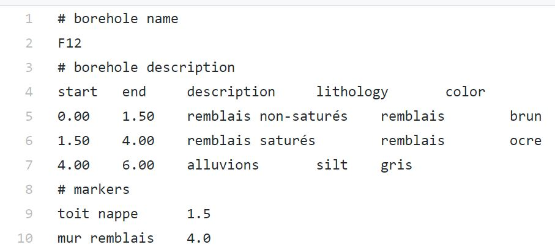
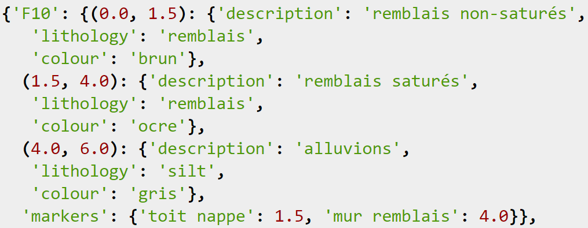
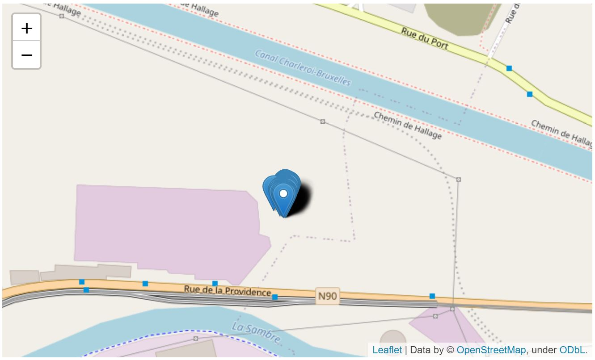
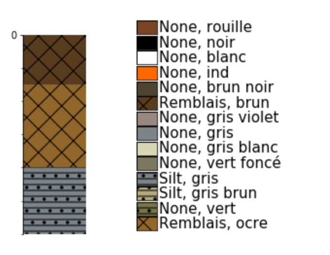

2019 project release
-----------------------
**Target:**

2D and 3D représentation of data acquired with electrodes in boreholes on a polluted site near Charleroi.

**Initial data:**

- One .txt for each borehole containing

    - its name
    - its description
    - its markers

    
- One .txt containing electrodes data for each borehole

- a legend in a .csv file

Transfer of the boreholes data into a SQLite database
_________________________________________________________

**a. Creation of a dictionnary to store the data**

Use of the fonction: *read_boreholes_description*

.. code:: python

    boreholes = {}

    for i in boreholes_list:
        d = read_flat_files.read_boreholes_description(filename='{dir Log_{borehole_name:s}.txt'.format(
            dir= work_dir, borehole_name=i))
        boreholes.update(d)
        

Example of dictionnary entry:

**b. Connecting to an existing database or to creating a new one if the database doesn’t exist**

.. code:: python

    conn = sqlite3.connect(database)
    
**c. Building a Lexicon for borehole data**

.. code:: python

    boreholes_dict_to_sqlite3_db(boreholes, conn, commit=True, verbose=False)

Creation of a geopackage from SQL
___________________________________

- display boreholes on a map 
- create the gpkg database from an existing sql3database and shapefile data

**a. Copy tables of a SQL3 database to another database**

.. code:: python

    def db_copy_sqlite3_tables(db_in, db_out, tables):
    """
    Copy tables from one database to another
    :param db_in: full filename of the origin of tables
    :type db_in: string
    :param db_out: full filename of the destination of tables
    :type db_out: string
    :param tables: list of tables to copy
    :type tables: list
    :return: status, 0: OK, 1: failure
    :rtype: int
    """
    import sqlite3
    import pandas as pd

    status = 0
    try:
        conn_in = sqlite3.connect(db_in)
        conn_out = sqlite3.connect(db_out)
        for i in tables:
            df = pd.read_sql_query("SELECT * from {table:s}".format(table=i), conn_in)
            df.to_sql("{table:s}".format(table=i),conn_out, if_exists='replace', index = False)
        conn_in.close()
        conn_out.close()
    except Exception as e:
        print('Error copying tables:\n {error:s}'.format(error=e))
        status = 1
    return status

**b. Access SQLite**

.. code:: python

    conn = sqlite3.connect('/home/gfa/test/GSDMA2019-develop/project_database.db')
    conn
    cursor = conn.cursor()

**c. Create a list of tables**

.. code:: python

    tables = []
    for table in cursor.execute("SELECT name FROM sqlite_master WHERE type='table';"):
    print(table)
    tables.append(table)

    

**d. Create a gpkg from a shp**

.. code:: python

    dat_shp = gpd.read_file("/home/gfa/GSDMA2019/playground/pilote/pilote/Pilote_v7.0.shp")

**e. Change the CRS to WGS84**

.. code:: python

    dat_84 = dat_shp.to_crs(epsg=4326)

**f. Create GPKG from gdf**

.. code:: python

    dat_84.to_file("dat.gpkg", driver="GPKG")

**g. Copy tables**

.. code:: python

    db_copy_sqlite3_tables('project_database.db','dat.gpkg',list_tables)

**h. use Folium to display the boreholes on a map**

.. code:: python

    dat_gdf = gpd.read_file("dat.gpkg")
    dat_84.to_file("output.json", driver="GeoJSON")
    ice_map = folium.Map(location=[50.455, 3.94],zoom_start=10)
    folium.GeoJson('output.json').add_to(ice_map)
    ice_map

   
Read data from a SQLite database with Striplog
_________________________________________________

**a. Import of the striplog object** 

.. code:: python

    from striplog.striplog import Striplog, Legend, Interval, Component
    from striplog.position import Position
    from striplog.lexicon import Lexicon  

**b. Connect to the database en import data**

- Use this fonction:

.. code:: python

    def create_connection(db_file):
    """ create a database connection to the SQLite database
        specified by the db_file
    :param db_file: database file
    :return: Connection object or None
    """
    conn = None
    try:
        conn = sqlite3.connect(db_file)
    except Error as e:
        print(e)

    return conn

- The code below read the database and put the data in the dataframe dfs

.. code:: python

    conn = create_connection(database)
    tables = ['Boreholes', 'Components', 'Intervals', 'Lexicon'] # table names in the database
    dfs = {}
    with conn:
        for i in tables:
            print("---{table:s} data--- ".format(table=i))
            sql_cmd = "SELECT * FROM {table:s}".format(table=i) # to select the data of the table Boreholes
            dfs.update({i:  pd.read_sql(sql_cmd, conn)})
    
**c. Definition of the legend**    

- use of a legend defined in a .csv

.. code:: python

    new_legend="legend_GSDMA.csv"  # A specific legend has been created which in islegend_GSDMA.csv
    my_legend = Legend.from_csv(filename=new_legend)
    legend = Legend.builtin('NSDOE')
    lexicon = Lexicon.default()

**d. Creation of the striplog object for one borehole**

- Use the fonction: 

.. code:: python

    def build_strip_from_list(bh_test):
    bh1_strip = []  # striplog object
    intervals = dfs['Intervals'].query('borehole=="{borehole:s}"'.format(borehole=bh_test))[['top','base', 'description']]
        for row in intervals.iterrows():
            components = dfs['Components'].query('borehole=="{borehole:s}" and top=={top:f} and base=={base:f}'.format(borehole=bh_test, top=row[1]['top'], base=row[1]['base']))
            components_dict={}
            for r in components.iterrows():
                components_dict.update({r[1]['key']:r[1]['value']})
            bh1_strip.append(Interval(**{'top': Position(middle=row[1]['top'], units='m'),
                                    'base': Position(middle=row[1]['base'], units='m'),
                                    'description': row[1]['description'], 'components': [Component(properties=components_dict)]}))
        return(bh1_strip)
    

- example for the borehole F15

.. code:: python

    bh_test = 'F15'
    strp=Striplog(build_strip_from_list(bh_test))
    strp.plot(my_legend, ladder=True, aspect=2)
    my_legend.plot() # pour afficher la légende

Display a borehole from Striplog in PyVista
_________________________________________________

**a. Create a Striplog Object from png**

.. code:: python

    from striplog import Legend, Lexicon, Interval, Component
    legend = Legend.builtin('NSDOE')
    lexicon = Lexicon.default()
    
    imgfile = "M-MG-70_14.3_135.9.png"
    strip = Striplog.from_img(imgfile, 14.3, 135.9, legend=legend)

**b. Add multiple intervals on the same plot**

- create a list of intervals

.. code:: python

    list_of_intervals = []
    for i in strip:
    list_of_intervals.append(i)

- create a plotter using Pyvista

.. code:: python

    plotter = pv.Plotter(shape=(1,1))

- add the list of intervals to the plotter with the function *add_intervals_list()*

.. code:: python

    def add_interval_list(intervals,plotter,radius=.09):
    """
    add a list of intervals to a plotter
    :param intervals: list of intervals to add to the plotter
    :type intervals: list
    :param plotter: plotter pyvista
    :type plotter: pyvista.plotting.plotting.Plotter
    :param radius: radius of the boreholes (if different radii, make distinct lists of intervals)
    :type radius: float
    """
    cylinders = []
    i = 0
    for interval in intervals:

        i = intervals.index(interval)

        center = (interval.base.middle - interval.top.middle)/2
        height = interval.base.middle - interval.top.middle

        cylinders.append(
                    pv.Cylinder(
                                    center = center,
                                    height = height,
                                    direction = (0.0, 0.0, 1.0),
                                    radius = radius,

                                  )

                            )

        plotter.add_mesh(cylinders[i], color="tan", show_edges=False)
    print(2)
    print(type(plotter))
    print(type(radius))
    plotter.show(auto_close=False, use_panel=True)

.. code:: python

    add_interval_list(list_of_intervals, plotter)
    plotter.show(auto_close=False, use_panel=True)

    

